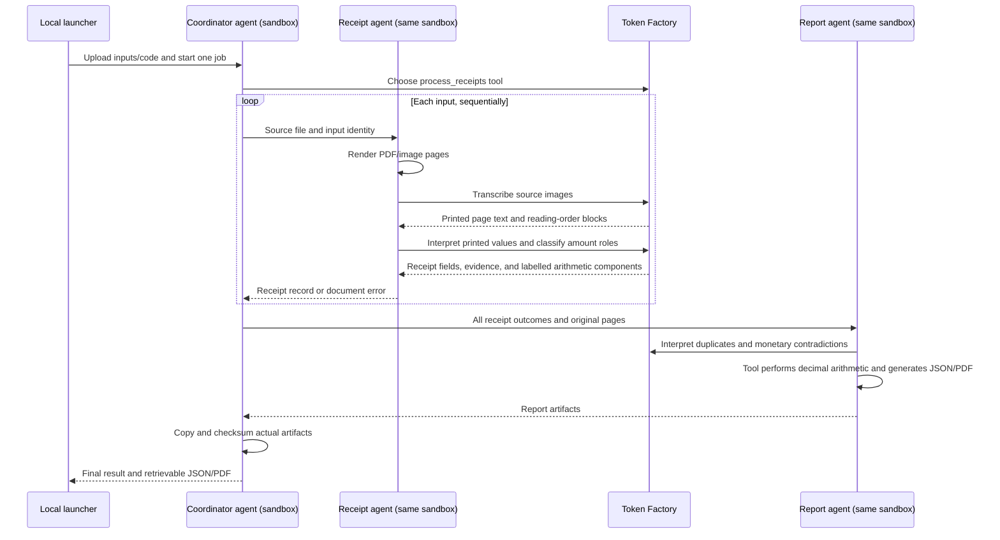

# Receipt agents on Nebius Sandboxes

This example demonstrates hosting agents in a sandbox and using Token Factory for
inference. One command produces JSON and a PDF with totals and original receipts.
Flags, duplicates, and document errors are finished automated outcomes.

## Run it

Use Python 3.10+ for the standard-library launcher, with a Nebius key and Project ID
that have sandbox access. The receipt workflow itself runs on Python 3.12.

```sh
python3 demo.py configure
python3 receipts.py --profile minimal --output receipt-output
python3 receipts.py --profile demo --output receipt-output-demo
```

The small `minimal` profile contains a readable receipt, an unreadable total, and
a corrupt PDF. `demo` is the default 14-input batch. Other fixture profiles are
listed in the [fixture guide](../fixtures/receipts/README.md). Positional file paths
replace the profile selection:

```sh
python3 receipts.py first.jpg second.pdf --output receipt-output-custom
```

Each output directory must be fresh. Successful runs write `report.json`,
`report.pdf`, `result.json` (the coordinator response), and `job.json` (the sandbox
operation and filesystem image IDs). `completed_with_flags` exits successfully;
a failed run exits nonzero. If a completed job's download fails, retrieve its
coordinator outputs again without launching agents or spending more inference:

```sh
python3 receipts.py --retrieve COORDINATOR_FILESYSTEM_UUID --output receipt-output-retrieved
```

Use the filesystem UUID printed by the run or recorded in `job.json`. The job is
non-disposable so its files can be downloaded after the process exits. Environment
variables are not preserved in that filesystem. Inputs and generated files remain
subject to the sandbox service's beta retention policy; this example creates no
persistent tag and offers no deletion guarantee. Retrieve artifacts promptly.

## What runs where



There are three agent implementations. Pydantic AI output tools ensure the
coordinator and report agent cannot merely claim they finished: their ordinary
Python tools must execute and return actual files. V1 runs receipt agents
sequentially inside the same job. [V2](https://github.com/kreuzhofer/nebius-token-factory-sandbox-demos/issues/14)
will move receipt instances and the report agent into separate jobs while keeping
the coordinator responsible for returning the result.

## Inference configuration

| Variable | Default / purpose |
| --- | --- |
| `NEBIUS_API_KEY` | Required Token Factory inference key |
| `CONTREE_TOKEN` | Sandbox credential; falls back to inference key |
| `CONTREE_PROJECT` | Sandbox Project header |
| `CONTREE_BASE_URL` | Sandbox API; existing demo default |
| `CONTREE_IMAGE` | Optional existing image with `/usr/local/bin/python3` and pip |
| `NEBIUS_AGENT_MODEL` | `Qwen/Qwen3-30B-A3B-Instruct-2507` for receipt interpretation and coordinator/report tool calls |
| `NEBIUS_VISION_MODEL` | `openbmb/MiniCPM-V-4_5` for image extraction |
| `NEBIUS_BASE_URL` | `https://api.tokenfactory.nebius.com/v1` |
| `NEBIUS_VISION_BASE_URL` | Falls back to `NEBIUS_BASE_URL`; can select a regional endpoint |

The tiny prime/tool example's `NEBIUS_MODEL` remains separate. Both receipt models
use explicit `OpenAIChatModel` and `OpenAIProvider` instances pointing to Token
Factory Chat Completions. The extraction model uses JSON-object mode with a
schema prompt and local Pydantic validation; it does not need tool calling.
Coordinator/report models need tool calling. Changing models requires compatible
capabilities and access on the selected endpoint.

Each receipt agent makes two bounded inference steps: the vision model transcribes
the pages, then the agent model interprets that text. The second call identifies
the payable total and distinguishes items/subtotals, discounts, added or included
tax, tender, change, carry-forward, and conversion amounts. This is internal to the
same receipt-agent implementation, not a fourth agent or a human review stage.
The original extracted page text remains in the result JSON. Interpretation errors
preserve that text when available. The supplied images determine page count and
order; an extraction that duplicates or omits pages gets the bounded validation
retry, and source page numbers are assigned by code.

The inference key goes only into the sandbox execution environment, is removed
from the agent process environment when constructing clients, and is excluded
from the dependency-install subprocess. Sandbox API credentials are not sent into
the V1 job. Logs record agent stages, selected models, and job IDs, excluding raw
model errors and credentials.

## Data and automatic outcomes

Version `1` JSON retains every source identity, merchant/date/currency, purchase or
refund direction, printed/normalized total, original page references, page text
and reading-order blocks, optional items/tax/discount, field evidence, and issues.
The JSON includes parsed receipts as well as reconciled entries and currency totals.
Money is represented as decimal strings; unknown fields are null. Original page
paths describe files within the job; the downloaded PDF embeds the rendered
originals so the report remains usable after remote storage expires.

- `included`: a resolved signed expense contributes once to its currency total.
- `flagged`: critical monetary uncertainty, an obvious contradiction, or suspected
  duplication excludes the expense. A missing secondary field alone need not.
- `duplicate`: confirmed duplicate, with `duplicate_of`; retain its source appendix.
- `error`: the source cannot be rendered or extraction attempts are exhausted.

When the report tool runs, Python checks a complete classified equation using one
basis: line items or a single subtotal, plus applicable discounts, added tax and
fees. Final totals, included tax, tender, change, carry-forward, and conversion
amounts are never addends. An incomplete equation does not create a false mismatch;
unknown critical expense fields still cause exclusion. Python applies decimal
arithmetic and signed refunds, with no FX conversion. Byte/pixel hashes detect
exact and re-encoded duplicates from actual inputs; semantic duplicate candidates
come from the report agent. Its instructions require positive shared-transaction
evidence for duplicate candidates and a concrete monetary conflict for additional
flags; similar layouts or missing item details alone are insufficient. Fixture
recipes, expected values, and source-group labels never become agent evidence.
Attribution is passed only to report rendering.

The PDF starts with totals, counts, a row per input, and appendix page references.
Each appendix contains extracted summaries and original pages in order; long
receipts may span multiple strips/pages. Unrenderable files get an explanatory
placeholder. Full transcription/evidence stays in JSON. No included receipts means
no confirmed totals, rather than an invented zero expense amount.

## Bounds and failures

The launcher accepts up to 30 inputs / 50 MiB; each PDF has at most eight pages and
each rendered page at most 25 million pixels. The default job timeout is 1,800
seconds, configurable from 300 to 3,600. Dependency setup has a 240-second limit.
Inference HTTP attempts have a 90-second timeout and one transport retry. The
coordinator is limited to one model request. Each receipt has up to two extraction
requests and two interpretation requests (one validation retry per step). The
report agent has at most two requests. Output-token caps are 6,500 for extraction,
4,500 for interpretation, and 6,500 for reporting. Sandbox job submissions are
never automatically retried after ambiguous responses.

Document failures are contained and the batch continues. Shared authentication or
model-access errors, report failures, and artifact-copy failures produce a failed
coordinator response with known outcomes where possible. If the process itself
fails before it can respond, the launcher reports the job failure. Local wait
timeouts/interrupts attempt operation cancellation; the server timeout is an
independent bound. Downloaded artifacts are checked against the coordinator's
byte counts and SHA-256 before a successful local result is published.

## Live verification: September 15, 2026

The corrected three-input run completed through Token Factory and returned
checksummed JSON and PDF after the sandbox process ended. The control receipt was
included at USD 14.75, the unreadable total was flagged, and the corrupt PDF was a
document error. Its coordinator operation was
`01a0a584-e46f-7106-9374-4935c34b2b00`.

The corrected 14-input `demo` run also completed from one launcher command:
8 included, 4 flagged, 1 duplicate, and 1 corrupt-file error. Every synthetic
receipt matched its intended outcome, signed amount and currency, including the
refund, discount, included tax, carry-forward, unreadable total and deliberately
inconsistent total. The exact copy was counted once. All 13 readable inputs used
one extraction call and one interpretation call. The coordinator returned both
artifacts from filesystem `1201f607-808d-47a2-aa6b-9d5f92acfccf`, operation
`01a0a59e-e394-7113-845a-2a6976550da8`.

Observed totals were CHF 54.50, EUR 102.10 and USD 16.93. Public receipts `r02`
and `r03` still had interpretation-related arithmetic flags; low-resolution `r01`
was read as USD 2.18 rather than the source's USD 2.13. These model limitations
remain visible in the outputs. The run demonstrates automated sandbox execution
and artifact handoff; it does not establish extraction accuracy for arbitrary
receipts. No output was manually corrected.

The original false-exclusion bug is covered by a regression test: a printed final
total must not be summed again with subtotal and tax. The local suite has 26
passing tests, including included-tax/carry-forward handling, genuine arithmetic
contradictions, page-count retries, and preservation of extracted text if
interpretation fails. Tool names are explicit and match the model instructions.

## Local verification

Use Python 3.12 and install the same pinned dependencies as the sandbox:

```sh
python3.12 -m venv .venv
.venv/bin/pip install -r receipt_demo/requirements.txt
.venv/bin/python -m unittest -v
```

Tests use fake models and temporary files. They cover refunds, per-currency sums,
unknown amounts, contradictions, duplicate handling, PDF rendering, all three
agent roles, shared/document failures, and checksummed artifact retrieval. Live
verification is a bounded execution check, not an extraction benchmark.

Implementation references: [sandbox file upload](https://docs.tokenfactory.nebius.com/api-reference/sandboxes/files/upload-a-file-to-the-server-the-body-must-be-a-file-content),
[file download](https://docs.tokenfactory.nebius.com/api-reference/sandboxes/inspect/download-a-file-from-image),
[instance lifecycle](https://docs.tokenfactory.nebius.com/api-reference/sandboxes/instances/spawn-a-new-container-instance),
and [Pydantic AI provider configuration](https://pydantic.dev/docs/ai/models/openai/).
